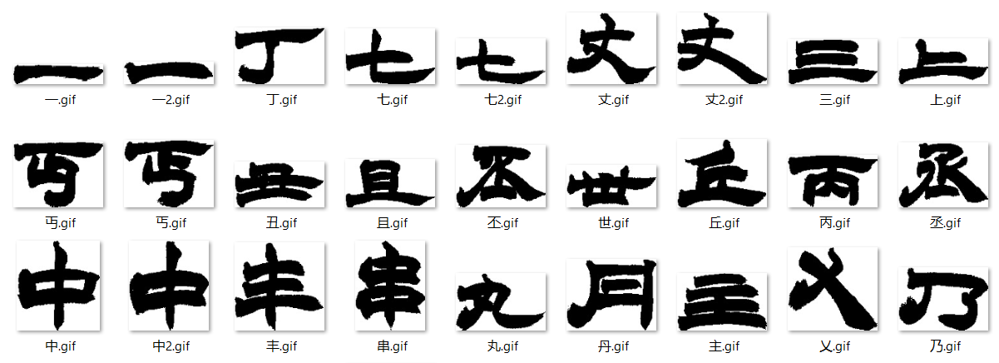

# ZiGAN Crawler
> Download images from [陈忠建字库](http://163.20.160.14/~word/modules/myalbum/), only for research purpose.

<p align="center">
  
</p>

## Usage
### Setup Dependencies
```shell
pip install playwright --user
python -m playwright install-deps
python -m playwright install webkit
pip install -r requirments.txt
```

### Start Crawling
```shell
python main.py --cid 38 --total_num 6841 --save_name 隶书-赵之谦
# or 
python main.py --cid 38 --total_num 6841 --save_name 隶书-赵之谦 --debug
```

## Disclaimer
We only use the downloaded dataset to help us to reproduce the experiment of *ZiGAN: Fine-grained Chinese Calligraphy Font Generation via a Few-shot Style Transfer Approach*.
